# Exploring the Diverse United States Counties: A Data-Driven Analysis of County Characteristics.

## Introduction

In the United States, there are 3,109 counties/county-equivalents across the continental part of the country (the 'lower 48' and the District of Columbia). These counties stretch from the mega city environment of New York County, New York, to the most sparse rural life of Loving County, Texas. Every county has something unique to offer, but there are patterns you see in some counties. Pick a random county, and it is likely pretty similar to counties nearby, which raises an interesting question: how are counties similar and different from each other?

More specifically, can we group counties together meaningfully with publicly available data? This project aims to answer that question and three broader research questions: which counties are similar to each other statistically? What counties are unusual to the counties around them? What kinds of counties exist?

Traditional geographic classifications often rely on simpler statistics, like population or their status as urban or rural, it's evident there are more complex patterns beneath the surface. Unsupervised machine learning provides an opportunity to uncover these patterns and use them to group counties together.

This project develops a pipeline of data that contains information on a county's demographics, economics, education, employment, crime, politics, geography, and climate, explores the makeup of the United States based on the variables in the pipeline, and then explores three different approaches to cluster the counties: k-means clustering using principal component analysis (PCA), hierarchical clustering (HC or HCA), and Gaussian mixture model clustering (GMM). Through these approaches, meaningfully significant archetypes of U.S. counties were found, and an engine of similar and unique counties was created.

Finally, the results of this project were synthesized to create a dashboard and an interactive map so that readers can more interactively explore the counties of the United States.

## Data Documentation

Several different data sources were processed and cleaned to craft a final dataset. To see the detailed dictionary of all the variables in the dataset, refer to [Appendix A](#appendix-a).

### Data Sources

#### American Community Survey (ACS)

The American Community Survey 2023 5 year estimates served as the primary source of the demographic, housing, economic, and educational characteristics of counties. Variables like median household income, median age, poverty rate, educational attainment, and much more were obtained from the ACS. Furthermore, the 2018 ACS was also used to construct 5 year changes in income and population, the latter of which being used to construct a population stability index. A diversity index was also engineered using race data from the ACS.

#### TIGER/Line Geography

TIGER/Line county boundaries were used as the backbone for all geographic visualizations throughout the project. In addition to county boundaries, TIGER/Line was the data source for a county's land area and its water coverage percentage.

#### PRISM Climate Normals

PRISM Climate normals were processed and used to characterize long-term conditions in a county's climate. Mean annual temperature and annual precipitation were obtained from this data source.

#### USGS Elevation

Via the R package elevatr, USGS elevation rasters were obtained and summarize to produce a county's mean elevation and the ruggedness (standard deviation) of its terrain.

#### NLCD / FIA Land Cover

National Land Cover Database and Forest Inventory and Analysis products were used to estimate forest coverage, the amount of land in a county that is forested.

#### County Health Rankings & Roadmaps (CHR&R)

The CHR&R was the data source for the homicide rate, suicide rate, and firearm fatalities of a county, as well as its voter turnout in the 2020 election.

#### MIT Election Data and Science Lab County Presidential Election Returns

The MIT Election Data served as the data source for the political variables of the dataset. These variables include the percentage of votes the Democratic party earned in the 2020 election, as well as three engineered variables: party competitiveness, and 20 year changes in both democratic vote share and party competitiveness.

#### Rural Urban Continuum Codes

The USDA Rural Urban Continuum Codes were used to effectively distinguish metropolitan counties from rural counties, validate the results of a particular decision made, and provide standardized metrics of urbanization among counties.

Overall, the data pipeline for this project was thorough, containing several data sources and steps. First data was obtained in raw form. Then, it was cleaned, and variables were engineered. Then, every source was merged into one dataset using a county's 5 digit identifier, referred to as its GEOID in the project. Following the merger, the dataset was used as the backbone to clustering analysis. Finally, the dataset was used as an engine to be used in the accompanying Shiny Dashboard and Interactive Map. The full pipeline of data can be found in the first three scripts of the scripts folder, found in the accompanying GitHub repository.

## Data Exploration

Upon the creation of the first merged county dataset, exploratory data analysis was performed to get familiar with the variables, the counties, and the trends to be seen in the data. Firstly, the variables were explored using histograms. Several interesting histogram results are shown below.

{#fig-popdens-histogram}

{#fig-forland-histogram}

{#fig-gini-histogram}

{#fig-hcb-histogram}

{#fig-mhi-histogram}

{#fig-comp-histogram}

{#fig-rucc-histogram}

Several variables, like population density, median household income, Gini index, and housing cost burden follow roughly normal distributions, meaning those variables are roughly evenly and normally split around a mean. This makes sense intuitively for something like median household income, where so long as there is not wild variation in income depending on the county, you'd expect most counties in the US to fall somewhere on that scale.

Other variables, like forested land, have much more interesting distributions. Instead of following a typical distribution, the forest land cover is unique. It spikes at 0, which makes sense conceptually, as there are many counties in the US either in places with no forests, or just flat out urban areas where land to grow forests is hard to come by. Then, forested land % is pretty steady at around 100 counties for each level of forested land. Then it falls off as it approaches 100% forested land. There's no other variable with a distribution like that, making it one of the most unique metrics available.

For the sake of simplicity, it can be assumed that most of the remaining variables not mentioned or plotted have distributions that are not normal or easily represented with a histogram.

The next point of exploration was correlation. Before using these variables to cluster counties together, it is useful to know how variables are correlated to one another, thus when selecting variables to use, knowing which ones affect each other potentially more than they affect the cluster.

{#fig-top20-corr}

The above plot shows the top 20 correlated pairs by absolute correlation. Some pairs, like median age and over 65% or median earnings and median household income, make logical sense to be high. A few interesting patterns do arise. The party competitiveness swing being correlated with a democratic swing indicates that more counties that had previously voted republican became swing counties between 2000 and 2020. Median gross rent being highly correlated with retail percentage is interesting, showing that when your rent is higher, you're more likely to work in retail.

In terms of negative correlations, most of the highly negatively correlated pairs make logical sense, with the most unexpected pair being democratic swing being negatively correlated with high school %.

The following graphs show more specified heat maps of correlations within the individual types of variables.

{#fig-corr-demo}

Most demographic variables remain uncorrelated with each other, indicated that the scope of the variables selected for this category do an adequate job of not telling the same story with every variable. The variables that are correlated also make perfect sense in context, such as diversity index being correlated with foreign born %. An interesting note that population stability index remains relatively uncorrelated with population growth, which seems odd at first, since the growth was used to craft the index, but this too makes sense because the growth going up or down makes the index go up or down too.

{#fig-corr-econ}

The economic variables, unlike the demographics, are highly correlated with one another. Almost every correlation on the heatmap makes perfect sense in context, and while they are correlated, only a few pairs are highly connected enough to warrant saying they speak to the same pattern.

{#fig-corr-emp}

The variables of the percentages of workers in specific fields are highly uncorrelated, which is quite interesting. It indicates that a county having a higher or lower level of workers in one field does not necessarily inherently mean that another is much lower, it's more evenly split.

{#fig-corr-geo}

A couple of interesting notes from the geographical correlations show us that the distance to coast is negatively correlated with forest coverage, temperature, and precipitation, while precipitation and elevation are negatively correlated as well. Unshockingly, elevation is positively correlated with terrain ruggedness.

{#fig-corr-trans}

Finally, all of the transit variables make sense with one another. Walking or biking to work is negatively correlated with one's commute time and whether they drive alone, while working from home is positively correlated with access to internet.

Another way to examine the data came with plotting the variables with the counties on maps of the US. This proved to be one of the better ways of story telling with the data, and gave a sneak peak into what the clusters might look like.

{#fig-precip-map}

This map of precipitation shows an interesting insight about the US. Not as much rainfall occurs in the middle of the country as it does in the west and so called "Tornado Alley", an apt name given its strong performance in this statistic.

{#fig-diversity-map}

While some maps show a clear pattern, some take a little more effort to spot, such as this one of the diversity indexes of every county. It is clear that the southern US is more diverse on average, but within the south, parts of California, Texas, and Florida all reach the highest scores, while in the north, there are still some diversity strongholds like the Chicago and New York metro areas.

{#fig-forest-map}

This map of forest coverage shows that much of the Great Plains have very little forest, something validated later by the clusters. Furthermore, the most forest areas stretch many different parts of the country, showing that outside of those places with little forest, the US is healthily covered in trees.

{#fig-psi-map}

This map, while a bit noisy and messy, does show some interesting trends. The way the population stability index is calculated punishes both counties with fast growing populations and decreasing populations, with an emphasis on punishing the decreasing counties. So, it's not a surprise that mostly more rural counties across the country are given lower scores, while the general pattern of the north losing population and the south gaining is somewhat visible, but much more subtle than previously imagined.

{#fig-poverty-map}

This map of poverty rate shows just how under-served communities in the south and the plains region are. They, on average, have significantly higher poverty rates, with some counties reaching a dangerously high 40-50% poverty rate.

{#fig-rucc-map}

Using the RUCC codes, the difference between rural and urban counties is incredibly clear on the map. You can see major metropolitan areas like New York and their suburbs, and across the Midwest you see clusters of more urban counties around the cities like St. Louis, Kansas City, Oklahoma City, etc.

{#fig-tr-map}

This map is one of the clearer visualizations at showing the two major mountain ranges in the US, the Appalachian and Rocky Mountains. The Rockies tend to produce more rugged counties, counties whose standard deviation of their elevation is quite high, while the Appalachian mountains show high ruggedness in a part of the country that is otherwise relatively flat.

These maps help provide even more context into the variables and the counties that this data set is exploring, and build towards the next section: clustering.

Further maps of every variable can be found in the interactive dashboard.

## Clustering

Clustering is the natural next step to answer the research question of what types of counties there are in the U.S. Through dividing every county into unique groups, we see natural patterns arise. Clustering provides a data driven approach to this situation: it produces archetypes of counties based on the data, not on our preconceived notions for types of places in the country.

This raised the next question: what should be used to group the counties together? Multiple counties may be similar on demographics or economics but differ greatly on climate or politics. Therefore, the clustering analysis performed in this project attempted to take each variable grouping into account at the same time.

Furthermore, different clustering algorithms may come with different assumptions about what a cluster looks like, how similar counties in the cluster have to be, how different they have to be from other clusters, as well as what variables are important and what variables are not. Therefore, three different clustering methods were explored. Through these three methods, several insights into American counties and how they can be grouped together were found, three similar but unique cluster groups were found and compared with one another.

For this project, three different clustering methods were performed to group counties together. The first method was k-means clustering after principal component analysis, then hierarchical clustering and Gaussian mixture modeling. These approaches can be examined for their own insights into clusters as well as compared together to find how they differ as well as the archetypes of American counties that they agree on.

#### K-means Clustering After PCA

The first clustering method was k-means clustering following Principal Component Analysis. PCA is a method in data science that shrinks large datasets down to fewer columns. It involves scaling the data, finding how columns are correlated and change together via a covariance matrix, and performs linear algebra to pick new axes or columns based on how much data they show. For example, the following are the loadings and map of US counties based on the first 3 principal components.

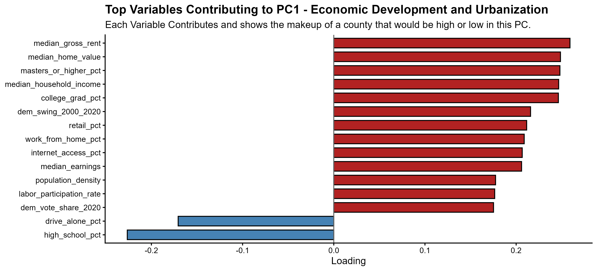{#fig-pc1loadings}

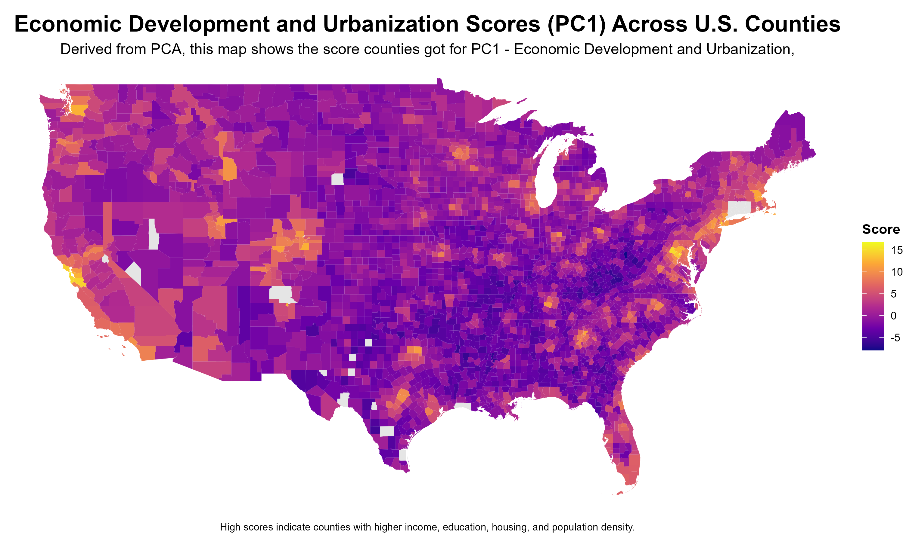{#fig-pc1map}

Principal Component 1, the PC with the most variance explained, is driven highly by economic development and urbanization. Variables like median gross rent, home value, income, educational status, and metrics of urbanization like population density, internet access, and democratic vote share rate highly in this PC, while factors like whether or not a county's population drives alone to work rates relatively lowly in this PC. The map helps affirm this, as metropolitan areas like Chicago, New York, Baltimore, San Francisco, and Dallas all have high scores on this PC, while much of the Appalachian and Southern suburban counties rate lower.

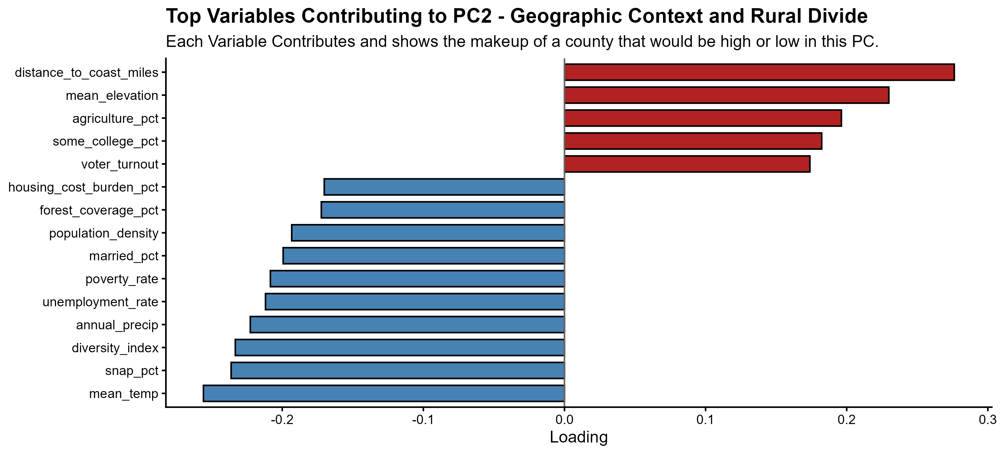{#fig-pc2loadings}

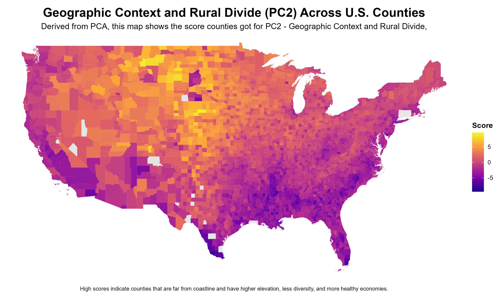{#fig-pc2map}

PC2, in contrast to PC1, tells a story of an agricultural group of counties. Counties with high scores in this PC typically are far away from coastline, as shown in the map by the Great Plains region amassing the highest scores, have higher elevation, people in agricultural fields, and are less impoverished, reliant on SNAP, and typically colder. Areas in the South and Metropolitan Areas can be seen to rate lowly on this PC, while regions that did not rate highly in PC1, like Appalachia, tend to rate higher here.

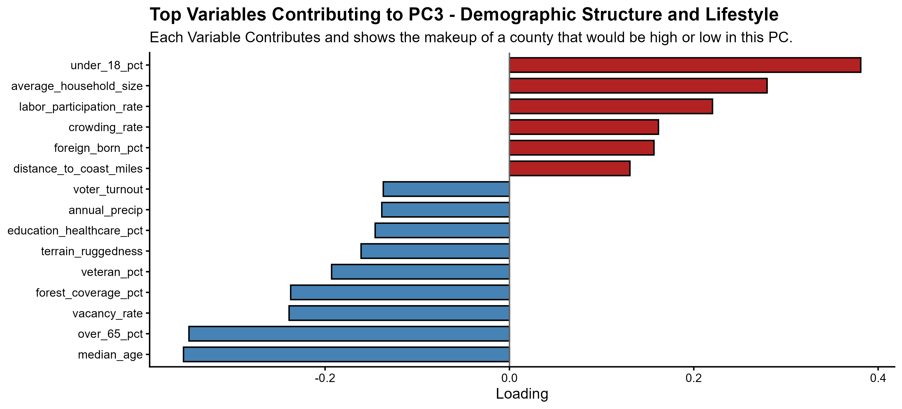{#fig-pc3loadings}

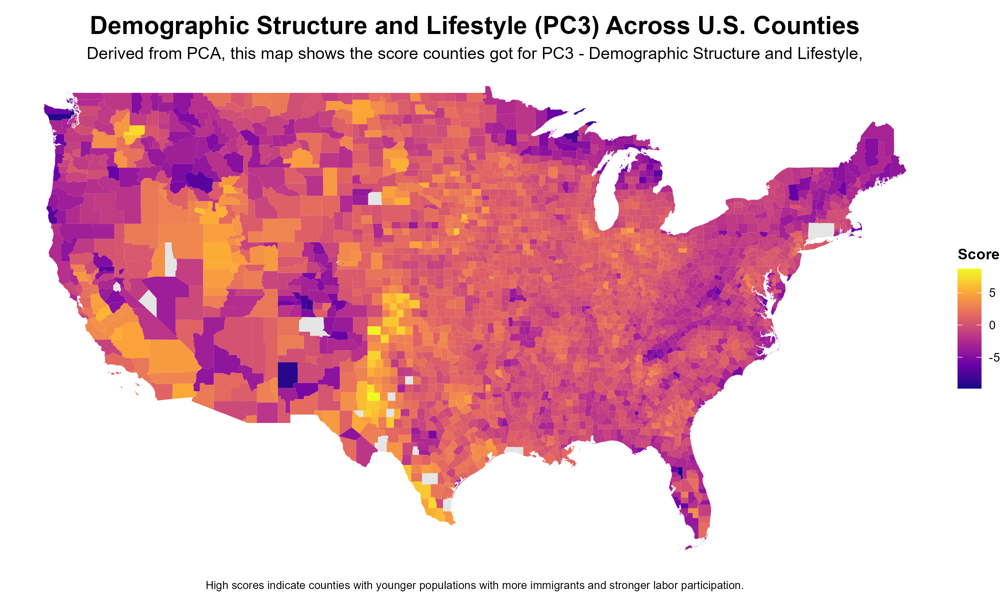{#fig-pc3map}

PC3 focuses much more on the demographics of a county. It favors counties who are younger, with a high loading of under_18_pct, as well as a higher average household size, intuitively making sense, as a younger population will have more children, coming with this is a higher crowding rate, more immigrants, and a lower median age. Typically counties that rate high in this PC do not have a high vacancy rate, a high rate of veterans, forests, or workers that work in education/healthcare.

Through these PCs, it is demonstrated how PCA can take many complex and differing variables and shrink them into smaller dimensions. The next logical question that must be answered before performing clustering is just how many PCs should be considered. The following plots each describe variance explained, or more simply, how much a PC contributes to describing the overall dataset.

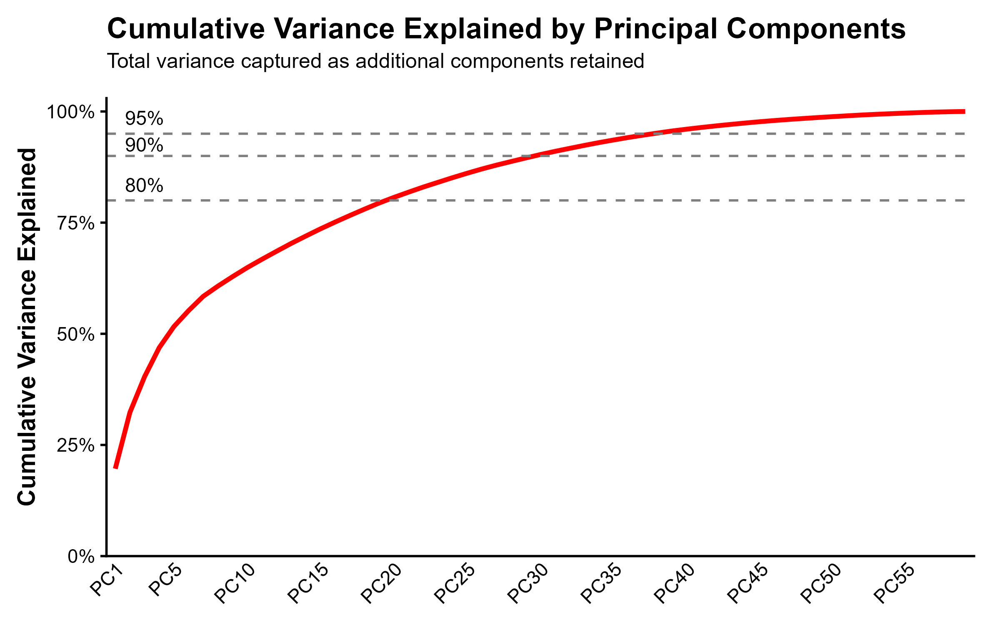{#fig-cumvar}

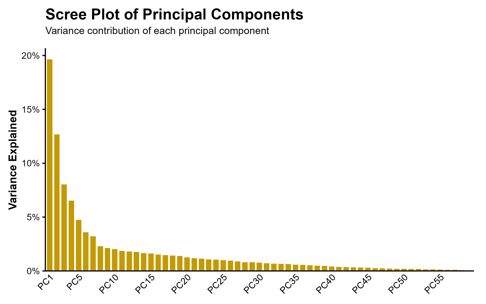{#fig-screeplot}

As can be seen, the first 10 PCs already explain about 70% of the variance in the dataset. This implies a strong backbone of PCs that differentiate counties well. From there, the next 10 counties combined account for just over 10% more variance explained, pushing past the first threshold of 80% variance explained. From here, a decision has to be made. Should the priority be to keep explaining variance but adding more complicated and less useful PCs into the dataset, or does hitting the threshold of over 80% with a round number like 20 indicate that 20 PCs is the viable amount to move forward. An alternative presents itself at 30 PCs, as that is where the threshold of 90% variance explained is crossed.

Throughout the course of k-means clustering, both 20 PCs and 30 PCs were checked against one another for robustness. It was hypothesizes that 20 PCs was the magic number for balancing explanation and complication, but for each round of clustering and analysis performed on the 20 PC dataset, the exact same analysis was performed on the 30 PC dataset.

In performing k-means clustering, the first step was to use metrics to decide what the best amount of k, or amount of clusters, was for describing the dataset. Through the use of elbow plots and silhouette analysis, 5 different candidates for k were pushed forward for further analysis: k = 5, 8, 13, 16, 20. From there, k = 16 and k = 8 were each removed because they told a similar story to k = 13 and k = 5, respectively. Maps for those amounts of k were still created, though, and can be found in the GitHub repository.

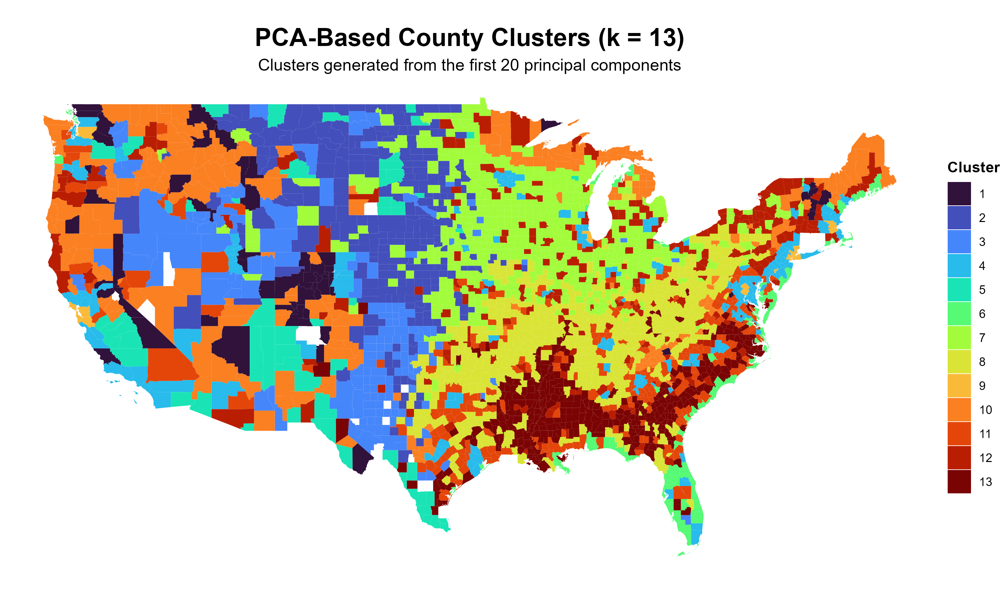{#fig-pc20map}

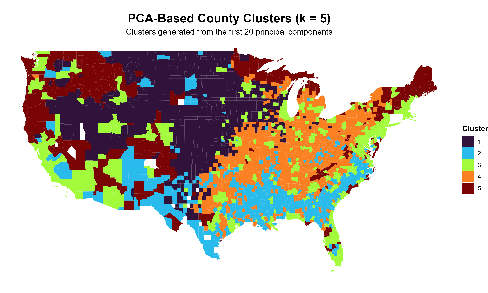{#fig-k5-map}

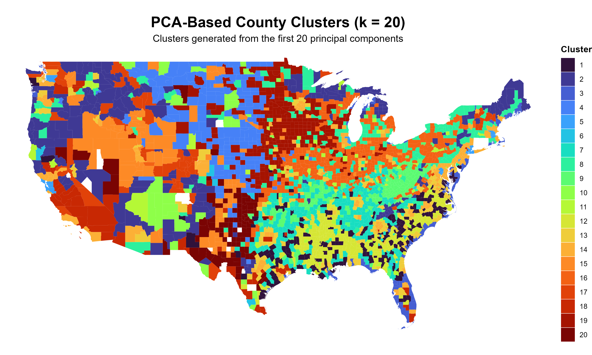{#fig-k20-map}

The final decider for how many clusters should be used between 5, 13, and 20 was how they performed in maps of US counties. Did the clusters make logical sense, group counties that are logically connected together, did not group too many counties together or too few, and were the results meaningful? Immediately, k = 5 was removed from contention. Having just 5 clusters made for too broad of clusters, averaging out to around 600 counties per cluster made it far too difficult to find meaningful patterns within counties. As can be seen in @fig-k5-map, clusters 1, 2, and 5 were particularly problematic, as they grouped clusters that were wildly different in geography together. This in and of itself is not inherently a bad thing, sometimes counties that are far apart geographically are connected in other metrics, but cluster 5, for example, grouped almost every coastal county with every major urban center, making for a cluster that is way too broad to examine. For these reasons, k = 5 was eliminated.

On a different notion, k = 20 is far too narrow. Its clusters do make more geographical sense than k = 5, but zooming in on the Deep South uncovers a problem. There are 3 different sub clusters of Southern counties, and when looking at their underlying metrics, they all represent the same archetype of county: an underserved, sometimes rural, southern community with high rates of diversity, poverty, and low rates of college education and internet access. There is no need for these counties to be split further on micro-differences like the amount of veterans or immigrants. While it can be useful to see the small differences within counties, there is no tangible reason to separate counties so narrowly in a way that makes analysis hard. Thus, k = 20 was eliminated.

That leaves k = 13 as the primary candidate for the amount of clusters. After a quick look at the map, it can be seen that this is a reasonable amount of clusters. While some clusters are small, the small clusters do make logical sense, and the problem clusters: particularly cluster 1, with random counties all over the country, is an interesting insight that warrants further examination. With this being the only problematic cluster, it was deemed insignificant enough to move forward with k = 13.

Before moving on to further analysis of the clusters, however, a robustness check was performed to see if adding the 10 additional PCs would meaningfully upgrade the clusters.

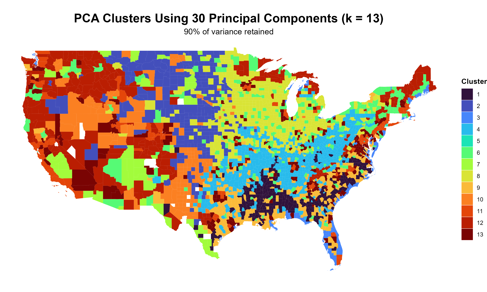{#fig-pc30map}

The above map indeed shows different clusters than the ones with just 20 PCs, but ultimately the archetypes are the same. The problem cluster 1 is replaced with problem clusters 6 and 7, and there is not enough evidence to suggest that the clusters are meaningfully "better", at least enough to warrant adding the 10 additional components. Thus, 20 PCs was chosen as the final amount of principal components for this project's PCA and k-means clustering.

With the parameters set of 20 principal components being used to create 13 k-means clusters, the clusters created can now be analyzed.

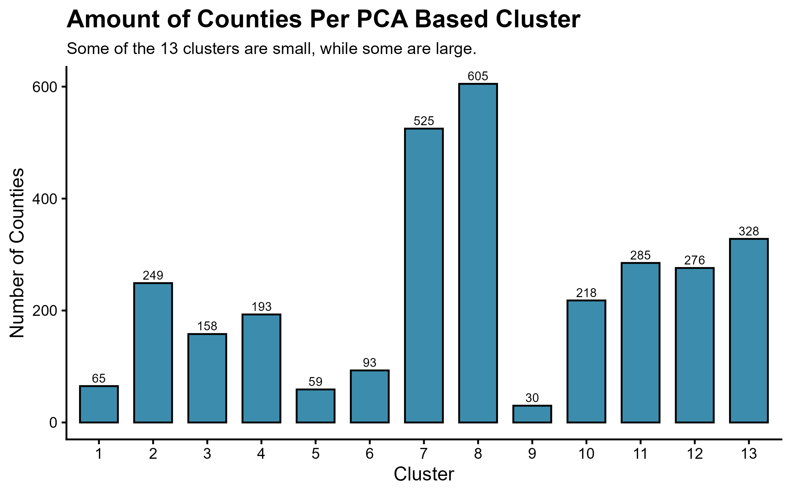{#fig-pcasizes}

The first metric to analyze how well the clusters perform is simply looking at their sizes. With this group of clusters, we see some interesting and slightly concerning results. Fourclusters, 3, 5, 9, and 12, have less than 100 counties. For an individual cluster to have few counties is not something to be worried about, and that's the case with clusters 3 and cluster 9. They're both clusters of metropolitan areas, and given the fact that there is simply a limited number of cities in the US, it makes sense that these clusters would be small. Cluster 5 and especially cluster 12, however, represent more broad archetypes of counties, cold rural counties and border counties, respectively, which makes it a little abnormal that those clusters are so small.

On the contrary, the big clusters also represent interesting areas of the US to group together. Cluster 2 is rural counties predominantly in Appalachia or the lower-Midwest region of the country, while cluster 8 represents more eastern older counties.

When these clusters were created, PCA k-means clustering was going to be the only form of clustering completed, but after seeing these results, it was decided that it would be worthwhile to look into other methods to see if similar conclusions can be drawn.

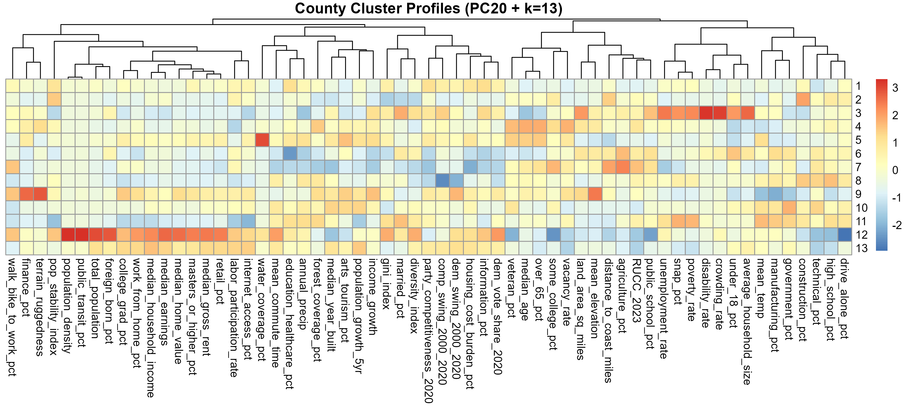{#fig-pc-heatmap}

The above heatmap shows each cluster on some of the variables in the dataset. It is important to remember that unlike the subsequent clustering methods, these clusters were not built directly on these variables, which explains why a majority of the variables have little correlations to most of the clusters.

From this heatmap, and a summary dataset of the clusters, brief explanations of what each cluster is can be crafted. Furthermore, each cluster's center, or average county in the cluster based on the PCs, was used to calculate distance from center using the Euclidean distance formula. The county in the cluster with the closest distance to this cluster was named the cluster's representative county. This information can all be found in the dashboard or in the following table. Each cluster was named, given its representative county, and a few key characteristics to help define what the counties in the cluster are like.

| Cluster | Archetype | Representative County | Key Characteristics |
|-----------------:|------------------|------------------|------------------|
| 1 | Frigid Retirement Communities | Delta County, CO | Older, cold, rural, veteran-heavy, low immigration, forested |
| 2 | Rural Appalachia / Lower Midwest | Greene County, TN | Highly rural, low income, high poverty and SNAP reliance, low diversity, Republican-leaning |
| 3 | Stable Urban Megacities | Westchester County, NY | Extremely dense, highly educated, highest reliance on public transit, relatively stable population, high immigration |
| 4 | Extraction Counties | Hockley County, TX | Low density, agriculture and extraction-oriented, dry, high immigration, low unemployment |
| 5 | Northern Rural America | Furnas County, NE | Extremely rural, low density, predominantly white, low poverty, cold, flat, low-cost |
| 6 | Midwest Suburbia | Jasper County, IA | Upper Midwest, suburban/rural mix, cold, predominantly white, low poverty, low-cost |
| 7 | Western Highlands | La Plata County, CO | High elevation, rugged, forested, relatively affluent, moderately dense, politically competitive |
| 8 | East Coast Aging Counties | Sussex County, DE | Older, relatively dense, low poverty, warm, wet, high water coverage |
| 9 | Sun Belt Metros | Grayson County, TX | Southern metros and their corresponding suburbs, relatively diverse, growing income, hot, flat, Republican-leaning |
| 10 | Underserved Southern Communities | Charlotte County, VA | Rural, lower density, poorer, declining population, high inequality and poverty, low internet access |
| 11 | Industrial Belt Cities | Summit County, OH | Smaller industrial metros, lower income/density, younger, relatively stable population, politically competitive |
| 12 | Border Counties | San Juan County, UT | Young, relatively diverse, high SNAP reliance and poverty, low income, high unemployment, dry |
| 13 | Growing Urban Centers | Harford County, MD | Rapid population growth, metropolitan/suburban, less dense than Cluster 3, lower poverty/cost of living |

: Table of k-means clusters.

While some clusters are defined by their geography or politics, others are defined by their demographics and economics. The metropolitan clusters also indicate that metropolitan areas are not a homogenous group: there are three different distinct archetypes of American cities.

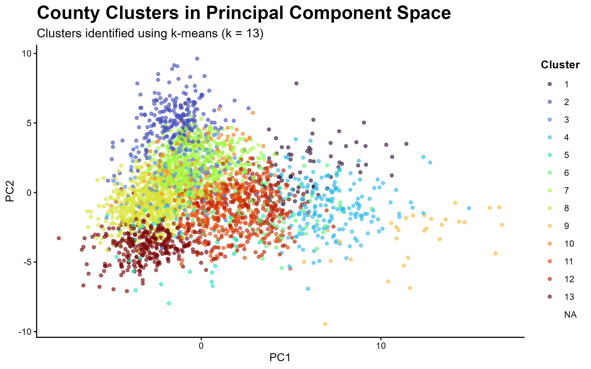{#fig-pcascatter}

Another interesting aspect of these clusters is the ability to map them in the space of the PCs that were used to construct them. The above graph shows just the counties mapped on PC1 vs PC2, and while lots of clusters overlap, there are a few clusters that certainly stand out as separate from the others. This validates the ability of the clustering analysis to correctly identify different archetypes of American counties.

Overall, it can be said that PCA and k-means clustering was successful in its mission to define county archetypes, but its results are not perfect. Some clusters are not super well defined, are too small or too big, or just otherwise not the most ideal they could be. For that reason, two other clustering methods are performed next.

#### Hierarchical Clustering

Hierarchical clustering is a process of clustering that involves building a tree-like hierarchy of clusters. This project used the divisive method of hierarchical clustering, basically starting with every single county in one single cluster, and then dividing the groups apart until naturally clusters form. Hierarchical clustering measures the distance between points via distance metrics, in this case, Euclidean distance.

Unlike with PCA, where every variable was used to create principal components, hierarchical clustering used the raw variables to construct the clusters. Several steps had to be taken for this. Firstly, a list of around 20 important variables were chosen based on their correlations with each other. It is important not to double-count patterns by including two highly correlated variables, such as median income and median earnings, so only one is included. Following the selection of variables, some minor data cleaning had to be performed to interpolate missing data. Some columns, such as forest coverage, did not have complete data, and state or even national medians had to be used to include them in the clustering process. Once all of this was complete, the dataset was ready to create hierarchical clusters, and the next step was choosing the amount of clusters.

Through the use of diagnostics elbow plot and silhouette, 3 separate feasible candidates for the amount of clusters were identified: 7, 10, 13. Like with k-means clustering, maps were created to identify the best cluster groups from there.

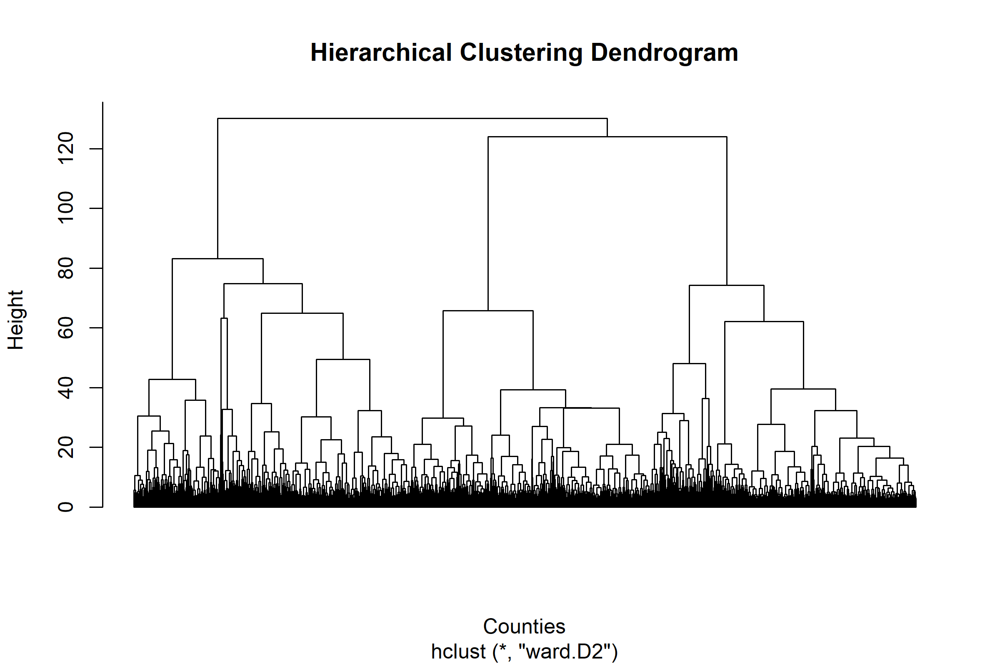{#fig-hcdendo}

The above dendrogram shows the first diagnostic of how many clusters could possibly be used. As can be seen, the true bottom row clusters are much smaller in size, so taking a step back in the height was used to evaluate the clusters more fully. There is a clear difference in the clusters, validating the hierarchical clustering's ability to distinctly identify different clusters.

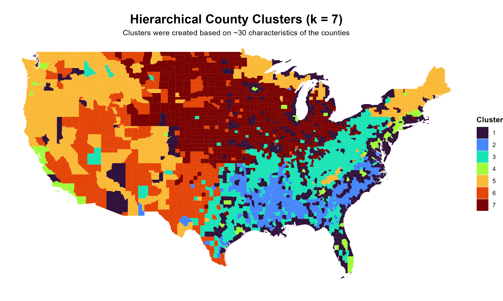{#fig-hck7map}

7 clusters is interesting, and relatively geographically aligned, but far too broad. The entire northeast is grouped with the far north and the west, which makes for one big umbrella cluster. Furthermore, while clusters like cluster 5 are huge, cluster 4 has very little counties. The amount of counties per cluster was far too inconsistent to be considered worth it, and the groups were too narrow. Thus, k = 7 was eliminated as a candidate.

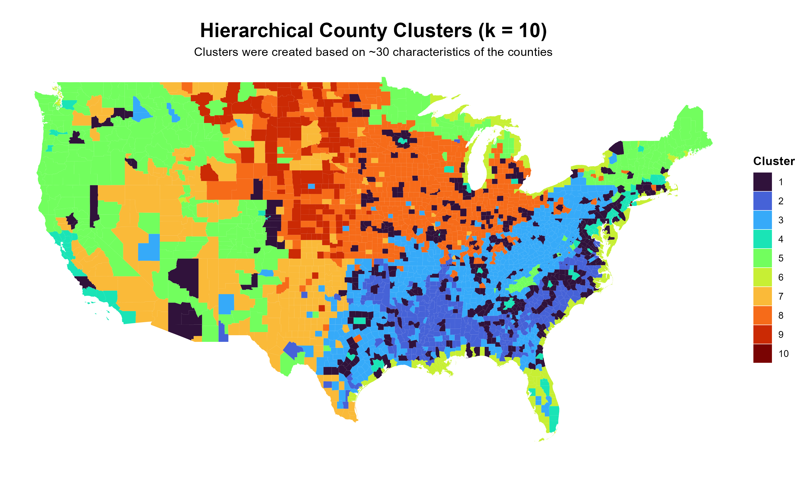{#fig-hck10map}

K = 10 emerged as one of the best candidates. It has all of the hallmarks of decent clusters, the clusters are geographically unique, somewhat consistent with the clusters from PCA, but like k =7, it has inconsistent clusters. Cluster 5 still groups the west with the north and the northeast, but there's also an interesting cluster 6 that takes away some of those counties and puts it in a cluster with Gulf Coast counties. The Plains region is also split. While this was a decent representation of clusters in the US, k = 10 was eliminated from contention for the amount of clusters due to this inconsistency.

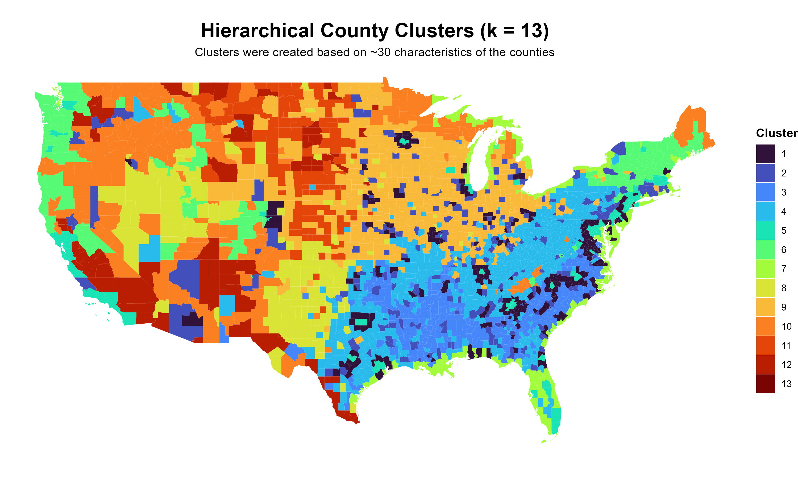{#fig-hck13map}

K = 13 performs similarly to 10 clusters, but with a few important distinctions. Firstly, the problem cluster combining west with North with Northeast is gone, replaced with a cluster that combined just the Northeast and PNW. This makes much more logical sense in context than combining nearly the whole west with all of New England. Furthermore, it keeps the same interesting insights of Gulf Coast/Border Counties in one cluster, a relatively united Midwest, a separated Great Plains, and distinct southern clusters from k = 10. For this reason, and the reason of keeping the amount of clusters relatively consistent with PCA, 13 was chosen as the amount of hierarchical clusters.

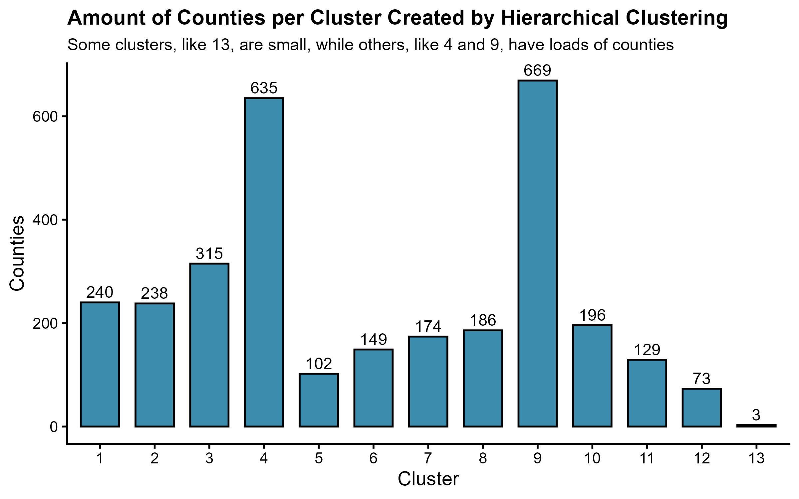{#fig-hcsizes}

Looking at the sizes of clusters, we see a few very interesting insights. Obviously, the big one is the 3 county cluster 13, whose counties are just Kings County, New York County, and Bronx County - three Burroughs of New York City. This is the first instance of a common theme throughout this project that New York City is simply the most unique place in America. No other city really comes close to its size, density, or anything like it. Sometimes it is grouped with other massive cities, but hierarchical clustering decided to give Bronx, Manhattan, and Brooklyn its own cluster. While this is a red flag ordinarily, because New York is so unique, it was deemed acceptable.

The two large clusters, 4 and 9, are both rural county clusters, one in Appalachia/South and one in the Midwest. These clusters being large also make sense intuitively because of the high rate of rural counties in those two regions.

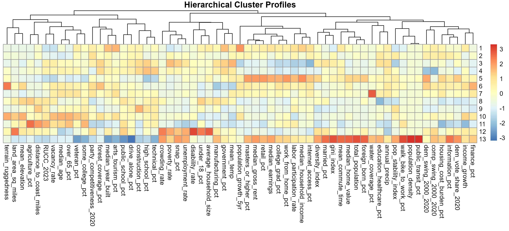{#fig-hc-heatmap}

The above heatmap shows how each cluster performs on each variable. Some clusters rely on just a few variables to differentiate themselves from the other clusters, while others, most notably the New York cluster, have very defined characteristics.

Similar to PCA, representative counties were found. Unlike PCA, however, the clustering method does not come with cluster centers, so they had to be calculated. This was done by calculated the mean of each variable in a cluster, with the set of means being the cluster's "center". Then, Euclidean distance from the center was calculated for each county in the cluster, with the county with the lowest distance being named the representative county. The following table summarizes the clusters, how they were named, their representative, and their prevalent characteristics.

| Cluster | Archetype | Representative County | Key Characteristics |
|-----------------:|------------------|------------------|------------------|
| 1 | Growing Affluent Suburbia | Fairfield County, OH | Wealthy suburban, highly educated, relatively low inequality, moderate diversity, growing population |
| 2 | Mid-Size Metropolitan Areas | Knox County, TN | Moderately dense metros, more diverse but lower immigration, moderate wealth and poverty |
| 3 | Underserved Southern Communities | Winston County, MS | Rural, hot, flat, poorer, declining population, high inequality/poverty, low internet access |
| 4 | Rural Middle America | Alexander County, NC | Rural, poorer, less diverse, elevated, rugged, forested, Republican-leaning |
| 5 | Urban Cores | Mercer County, NJ | Extremely dense, young, diverse, highly educated, wealthy, high cost of living, Democratic-leaning |
| 6 | Highland Regional Hubs | Buncombe County, NC | Rugged regional centers, lower density, cooler, older, smaller households, relatively low poverty |
| 7 | Established Older Suburbs | Lorain County, OH | Older suburban, relatively wealthy, lower poverty, less competitive elections |
| 8 | Resource-Rich Economies | Hutchinson County, TX | Extremely sparse, agricultural/resource-oriented, young, immigrant-heavy, dry, elevated, low forest coverage |
| 9 | Midwestern Agricultural Areas | Livingston County, IL | Rural, cold, flat, low diversity, high labor participation, low unemployment, low cost of living |
| 10 | Frigid Retirement Communities | Montezuma County, CO | Very cold, older, relatively wealthy, low diversity, veteran-heavy, low precipitation, Republican-leaning |
| 11 | The Great Frontier | Aurora County, SD | Extremely rural, cold, older, very low density, low cost of living, dry, little forest coverage |
| 12 | Rapidly Growing Border Counties | Luna County, NM | Young, large families, diverse, immigrant-heavy, rapidly growing, high poverty and reliance on SNAP, politically competitive |
| 13 | Downtown New York | Kings County, NY | Extremely dense, diverse, transit-oriented, urban, uniquely distinct from other U.S. counties |

: Table of hierarchical clusters.

These clusters will be compared to both the PCA driven clusters and the clusters obtained in the following method later in this report.

#### GMM Clustering

The final clustering method performed was Gaussian mixture modeling clusters. Unlike the previous two methods where clusters are defined rather definitively, GMM brings probability to the clusters. Rather than simply assuming each county belongs to just one county, it models the data as a mixture of several different probability distributions. Each county is assigned a probability of being in each cluster, and the cluster which has the highest probability is the assigned cluster for that county. This is particularly useful in this dataset, where counties are going to be fluid in their similarity to other counties, and it is uniquely difficult to assign black and white clusters because of the inherent similarity of counties.

Similar to hierarchical clustering, variables were selected as important and missing data was interpolated to prepare for clustering. The exact same process and variables were used in both hierarchical and GMM clustering.

The GMM analysis identified 14 county clusters. For any given county, a probability distribution of it being in each of the 14 clusters is run, and it identifies, for example, a 70% chance of being in one cluster, 20% in another, 10% in a third, and 0% in the remaining 11 clusters. This allows for some level of uncertainty to be justified by the data. The following graph plots the uncertainty, or 1 - the probability of the county being in its assigned cluster.

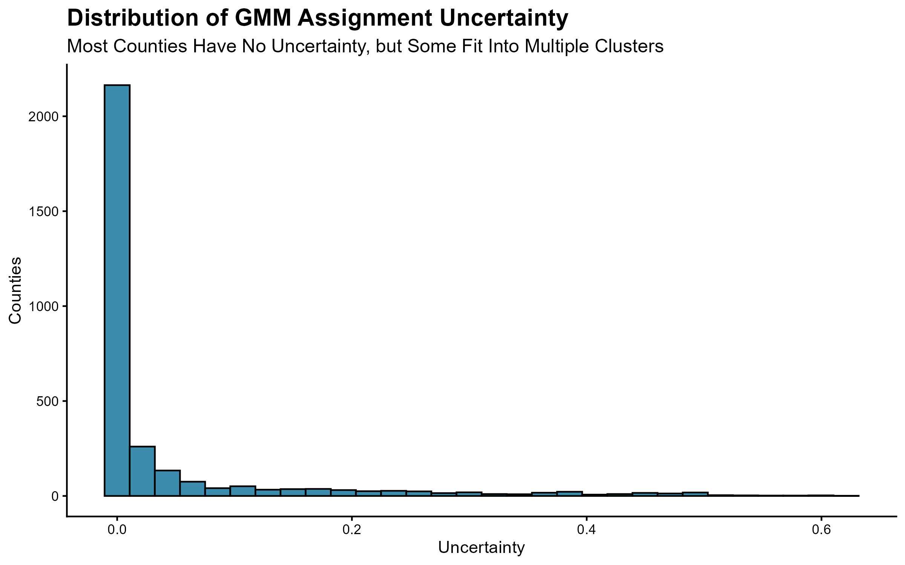{#fig-gmm-uncert}

As can be seen above, the majority of counties had uncertainty of 0. This means that the GMM model ran the probabilities and found a 100% chance of the county belonging to one particular cluster. This validates the model's ability to uniquely identify separate county groupings, because if a majority of the counties fit nicely into one particular cluster, that means the clusters are well defined and accurate. Some counties had low but nonzero uncertainties, while the highest level of uncertainty was .6, meaning there was a county who fit into so many different clusters that the cluster it was assigned to was only given a 40% chance of being the cluster it belonged to. Because very few counties have this distinction, again, GMM clusters prove themselves as valuable additions to the project.

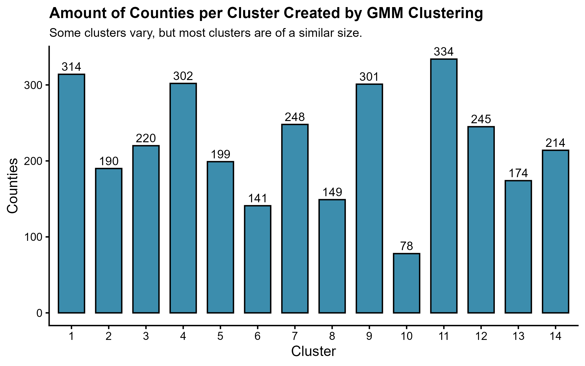{#fig-gmm-sizes}

The size distribution of the GMM clusters is by far the healthiest distribution of cluster sizes of any of the 3 methods. The smallest cluster has 78 counties while the largest has 334, and most clusters are more or less 250-300 counties large. This is excellent, and gets even better in context, where it is known that cluster 10 is the urban megacity cluster, making it make perfect sense that it is the smallest cluster.

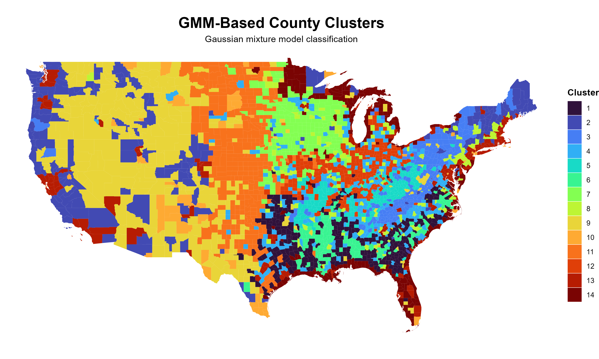{#fig-gmmmap}

The above map shows the U.S. counties based on their GMM cluster. Interestingly, the probabilistic approach to assigning clusters made it so while there is a clear geographical divide between the clusters, it is much more nuanced than the other two clustering methods, particularly in the Midwest and Appalachia. Several different clusters have footholds in those regions, and most of the counties with nonzero uncertainty came from these regions. Still, these clusters pass the eye test.

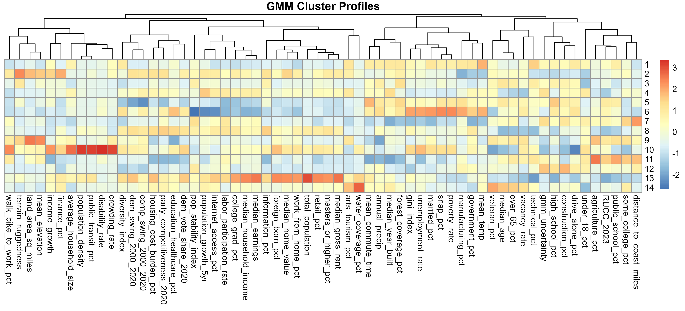{#fig-gmm-heatmap}

The above heatmap shows that most clusters only relied on a few variables to be defined. Some clusters were defined on most of the variables, while some on just \<8.

Similarly to hierarchical clustering, cluster centers were created based on means in each variable, and representative counties were created based on Euclidean distance to these cluster centers. The clusters, their names, representative counties, and descriptions are synthesized into the following table.

| Cluster | Archetype | Representative County | Key Characteristics |
|------------------|------------------|------------------|------------------|
| 1 | Southern Working-Class America | Laurens County, SC | Diverse, hot, flat, southern, Republican-leaning, high rainfall, low internet access |
| 2 | Affluent Coastal and Rugged Counties | Ulster County, NY | Affluent, highly educated, cool, rugged, coastal or near large bodies of water, high housing cost burden, suburban/exurban |
| 3 | Older Industrial Heartland Counties | Washington County, OH | Older, inland/eastern, less diverse, lower educational attainment, Republican-leaning, forested and rainy |
| 4 | Growing East/Midwest Suburban Hubs | Butler County, OH | Young, diverse, growing, suburban, slightly hotter and flatter, relatively low poverty |
| 5 | Appalachian Rural America | Carter County, KY | Rural, predominantly white, older, forested, lower workforce participation, high high-school-only attainment, Republican-leaning |
| 6 | Historically Black Southern Counties | Halifax County, NC | Rapid population decline, highly diverse, very low foreign-born population, high poverty and reliance on SNAP, low income, low internet access, hot, flat and rainy |
| 7 | Upper Midwest Agricultural Centers | Henry County, IL | Cold, rural, agricultural, low diversity, low forest coverage, large counties, small households, Republican-leaning |
| 8 | Mid-Sized Metro Suburbs | Summit County, OH | Dense for non-urban counties, young, diverse, suburban, concentrated in Midwest/East Coast, politically competitive |
| 9 | Western Rural Recreation Areas | Washington County, ID | Very low density, highly rural, older, agricultural, rugged, high elevation, Republican-leaning |
| 10 | Global Urban Centers | Baltimore City, MD | Extremely dense, young, diverse, larger households, lower educational attainment, higher poverty/SNAP reliance, Democratic-leaning |
| 11 | Extraction Plains Counties | Stafford County, KS | Dry, agricultural, low unemployment, short commutes, affordable, Republican-leaning |
| 12 | Midwest Small Towns | Shelby County, IN | Small population, very low diversity, lower educational attainment, low inequality, flat, Republican-leaning |
| 13 | Rich Urban Centers | Baltimore County, MD | Large, wealthy urban/metropolitan counties, diverse, highly educated, growing, lower poverty, high cost of living |
| 14 | Retirement Suburbs | Worcester County, MD | Very old, flat, rainy/snowy, coastal or Great Lakes-adjacent, water-heavy, geographically split between cold northern and hot southern regions |

: GMM Clusters.

Two clusters: 10 and 13, demonstrate the flexibility brought with the GMM approach. Like the two methods before it, GMM produces multiple metropolitan area clusters. Unlike the other two, however, these clusters differ mainly on demographics, not just geography. Cluster 13, Rich Urban Centers, are typically much wealthier, less diverse, more educated, with less stable populations and lower poverty rates than Cluster 10, Global Urban Centers. Despite their shared urban characteristics like population density and public transit reliance, as well as their rather mixed geographical profile, GMM assigned them as different counties because of their different economic and demographic background.

## Comparing Clusters

Each cluster method provided their own insight into how to divide U.S. counties into distinct groups. It is worth diving in to how they compare to one another, where they agreed, and where they disagreed.

Adjusted Rand Index (ARI) is an effective metric to compare the similarity of two data clustering assignments. The closer to one the ARI is, the more agreeable the clusters are. 0 represents random chance, while negative numbers implies that the clusterings disagree.

PCA and Hierarchical had an ARI of .46, meaning that they have a moderate agreement on their cluster assignments. It implies that they are not a perfect fit with one another, but they're nowhere close to being antagonistic toward each other.

GMM compared to both PCA and Hierarchical produced an ARI of .26, implying a weaker agreement between GMM and the other methods. Still better than random chance, but they do not necessarily agree on what clusters there are or what counties to put in them. This result is actually quite interesting, and further proves the need to have three separate clustering assignments. Each method produced relatively independent results that were not copied by the other methods, meaning that each of them brings something different to the table of clustering U.S. counties.

A county may have some characteristics that align it more with a rural, rich, plains county while having other characteristics that closer align it with more metropolitan or suburban counties. The three separate models each have their own way of discerning where that county would belong, and using the results of all three helps us understand what types of counties there really are in America even better.

The models do agree on some county archetypes, and the results of all three are synthesized into 13 different common archetypes in the following section.

## Exploring County Archetypes

The clustering section of this project answers one of the key research questions: what kinds of counties exist? Each clustering method used provided 13 or 14 clusters (40 different cluster archetypes total) of U.S counties ranging from incredibly small to incredibly large, each with different characteristics and makeups.

Rather than treating the output of any one clustering method as the definitive classification of U.S. counties, the results of all three methods were compared and synthesized. The archetypes below represent recurring patterns found across the three clustering approaches. Therefore they are interpretive archetypes rather than the output of a fourth clustering model and are not treated as a clustering results.

1.  **Midwest** **Suburbia** - These counties are exactly as they sound. They’re almost all located in the Midwest, and while each of the clustering methods has different criteria, some more rural and some more urban, this chunk of the Midwest is in each of the three methods. These counties are typically wealthier than some other rural suburban areas, but have much lower diversity, less immigrants, are typically colder, and have a relatively low cost of living. They’re typically located within driving distance of the major cities in the area (Chicago, St. Louis, Detroit, Milwaukee, etc.) and vote Republican in elections more often than not. 
2.  **Great Plains Rural Areas** - These areas are similar to the Midwest Suburbs, but differ in a few key ways. Geographically, they’re typically located in the Great Plains region, further west than the typical Midwest. They feature some of the lowest precipitation rates in the country, as well as a higher than average rate of agricultural workers.  They’re also the coldest counties in the country on average. These counties are extremely rural, averaging less than 10 people per square mile, and are predominately white and above the poverty line. These counties vote extremely Republican in elections. 
3.  **Frigid Retirement Communities** - These counties are clustered together with the southern retirement communities in GMM clustering, and sometimes clustered with the border counties, but are distinct enough that they warrant their own summary.  They are freezing counties across the US, ranging from the PNW to Rockies to Upper Midwest to Northeast. These counties are much much much older than average, feature low diversity, and are relatively wealthy. Unlike other suburban counties, these counties usually have rising populations. These counties feature the most veterans of any cluster as well. These counties don’t get a lot of precipitation, and when they do it’s usually snowfall. Elections in these counties typically favor Republicans. 
4.  **Underserved Southern America** - These counties, typically in the deep south of Mississippi, Alabama, and its surrounding states, obviously tend to be hotter and flatter, as well as more diverse, less dense, and poorer. An average county in this cluster has just under 24,000 people, and this population has been declining. These counties are typically much more rural, have very high income inequality and poverty. These counties also see a lot of rain compared to the average and have lots more forest. These counties are far and away the least internet-accessible counties. 
5.  **Rural Appalachia** - These counties, almost entirely located in the Appalachia region into states like Missouri and Arkansas, are extremely rural in nature. This cluster is not very diverse, and has low diversity and income, with a higher poverty rate and reliance on SNAP. It has the highest rate of construction workers, and overwhelmingly votes Republican.
6.  **Extraction / Border Counties** - These counties are a mix of two archetypes in the clusters that often found themselves mixing and matching with each other: the Middle American extraction counties, who were hotter with less rain, but saw high rights of agriculture, hence their extraction based economy, and rising border counties, either on the Mexican or Canadian border, that were heavily diverse with lots of immigrants. These counties range wildly in temperature, and typically have lower income and higher reliance on SNAP. 
7.  **The Rural Recreational West** - These counties, typically close to the Rocky Mountains, have low population density. These counties tend to be older, the most rural by RUCC codes of any county cluster, and a larger than average percentage of the workforce in agriculture. They also feature rugged terrain, high elevation, and extremely Republican favored elections.
8.  **Mid Size Metro Areas** - These counties represent one of three subgroups of the cities that are in US counties, with these being the more middle of the road in size and demographic counties. They’re fairly diverse, but not as much as the global super cities. They often contain the suburbs of some cities, but mainly contain your mid sized cities like Colorado Springs or Asheville. These counties have the same general structure as cities, just not as urban, slightly less wealthy on average with lower costs of living than the bigger cities. 
9.  **Rugged Coastal Suburbs** - These suburban counties differ from the other suburb counties in both their geography and their makeup. They tend to have more competitive elections, are much more coastal, and often are counties that are suburbs of cities like Seattle. Lots of the less urban counties in California fit into this category, as well as suburbs of cities like Boston that don’t fall into the affluent suburb category.
10. **Established Industrial Urban Cores** - This second group of city counties encompass a particular vibe of American cities, the Rust Belt or Rust Belt-esque cities, typically in the midwest or east, that have the same makeup of incredibly stable populations, competitive elections, and a legacy of industrial. Think of cities like Cleveland, Detroit, Charlotte, and others. These cities are less wealthy than the mega cities cluster, but more wealthy than the mid sized. The suburbs of these counties typically fall into the Midwest Suburbia or Underserved Communities clusters rather than affluent Suburbia.
11. **Global Super-cities** - Think of LA or NY or Miami, these counties contain megacities in the US that are extremely diverse, on average pretty wealthy (though that may be due to the high cost of living, as many still fall under the poverty line), extremely high population density, a bigger reliance on public transportation, and Democrat favored elections, all the hallmarks of a major US city can be found in this cluster.
12. **Affluent Suburbia** - Often the neighboring counties of the super cities cluster, Affluent Suburbia is a set of counties that is incredibly rich, that has similar income to those in the cities with much lower cost of living, making for low reliance on SNAP. Workers here are more likely to work from home or to drive alone, and these counties vary in geography (it all depends on the city they’re close to).
13. **Sunny Retirement Communities** - These counties, predominantly in Florida and Arizona, might be what you think of when you hear the words “retirement community.” Typically warm, with growing populations, these counties feature a relatively high rate of elderly, but lower than the Northern retirement communities. These counties are typically covered in water (usually the Gulf Coast) and feature most of the same demographic trends as the other retirement counties.

Some of these archetypes are clusters that appeared in multiple of the clustering methods, while some of them are merged combinations of different clusters. This synthesis makes the results easier to interpret rather than replace the original assignments. The accompanying dashboard only presents the results from the three clustering methods, allowing users to explore the methods and how they are different. These archetypes are only presented to provide a higher-level synthesized interpretation of the common patterns each clustering method identified.

## Finding Similar Counties

Another research question of this project was finding counties that were similar to each other. In the previous sections, clustering was used to answer this question. Finding archetypes that counties fit in was a way to define how counties are similar to each other, but that is only one aspect of this question. Another answer comes from directly comparing counties to one another.

The method of comparison chosen for this project was an engineered similarity score. This score was created through Euclidean distance. This metric was chosen because it was determined to be an accurate way to show how close counties are to one another, is simple enough to be used for a version one of this project, and is easy to understand. The similarity score is simply 100 - Euclidean distance of two counties. For example, if the Euclidean distance between two counties was 5.6, the similarity scores of those counties is 94.4, or it is also said the counties are 94.4% similar.

The same variables that were used in hierarchical and GMM clustering were used in similarity calculations. Through a few runs of the similarity engine, it was decided that geographical variables such as forest coverage should be weighted less than the rest of the variables. This was because the similarity engine was routinely pumping out counties that were neighbors as very similar to one another, when this is not always the case. While similar geography was an important metric in clustering, it was skewing the results of similarity, so it was scaled less. The following variables that had their weights changed are: terrain ruggedness weighted at .7, forest coverage percent weighted at .5, water coverage percent weighted at .5, annual precipitation weighted at .5, mean temperature weighted at .5, distance to coast weighted at .8, and mean elevation weighted at .7. All other variables were weighted at 1, making them unchanged.

The highest similarity score was 98.8 between Chippewa County, WI and Marathon County, WI. Other highly similar pairs were Clinton County, IA and Whiteside County, IL, Anderson County, SC and Rowan County, NC, and Henry County, OH and Fulton County, OH. A full list of similar counties can be explored in the dashboard by typing in any two counties and comparing them.

It was found that similarity scores never went below 65%. This makes logical sense in context, because while American counties may differ from each other, in the scope of the world stage, American counties are pretty similar as counties in a developed nation, a nation that does not have some of the same problems are other countries' counties might. While the scope of this project was just American counties, it is worth noting how baseline similar every single county in the US is.

## Finding Unique Counties

The final research question left currently unanswered is what counties are unique compared to the other counties. To answer this question, an engine of uniqueness was created. However, being "unique" can mean different things in different contexts. Thus, there were three different methods of uniqueness calculated: uniqueness compared to the nation, uniqueness compared to a county's neighbors, and uniqueness compared to other counties in its cluster. For each method, a uniform method for calculating uniqueness was created. It is the same as how similarity was calculated: Euclidean distance. For each different type of uniqueness, the Euclidean distance from the county being tested to every other county in the group was calculated, and the uniqueness score is simply the mean of the calculated distances. As the similarity engine already calculated distance for every possible county pair, these computations were simple to perform.

Calculating the uniqueness compared to the nation was done using the county's closest 100 counties by distance. This number was chosen after some trial and error. 25 closest counties was deemed to be too little, because sometimes counties can be very similar to just a certain group of small counties, but not similar to the whole nation. The entire county-set was deemed to be too large because of the expensive computation and the diluting of the data that adding all 3109 counties brought. 100 seemed to be a sweet spot.

For calculating the uniqueness compared to a county's neighbors, first neighbors had to be defined. For this project, a county's "neighbors" was defined as its direct bordering counties, and the counties that border those counties. Some counties that are on islands had to have their first order border counties directly engineered to be included in the dataset. This methodology made it so every county had somewhere between 2 and 40 neighbors, with the average being around 20.

Calculating the uniqueness compared to the cluster was simple. The GMM clusters were chosen because of their relatively uniform size, where the other two clustering methods had outlier clusters with very large or small amounts of counties. Then, the uniqueness calculation was just calculated from the mean of the distances within the county's GMM cluster.

Following all three methods of uniqueness were calculated, a total uniqueness score was also calculated by weighted sums of the 3 sub-uniqueness scores. National uniqueness was given a 40% weight, regional uniqueness (neighbors) was given 35%, and cluster uniqueness was given 25%. The full table containing full uniqueness scores is viewable in the data section of the GitHub repository, but the top 5 unique counties based on combined uniqueness score were: New York County, NY, Bronx County, NY, Kings County, NY, Los Alamos County, NM, and San Francisco County, CA.

## Limitations

While this project broadly explored characteristics, similarities, and uniqueness of U.S. counties, there are several limitations that ought to be considered when interpreting the results.

The first major limitations arises from the use of county level data. While counties are a uniform and useful geographic units that allows for easy combination of all sorts of different variables, they vary dramatically in both size and population. One county may contain hundreds of distinct communities who are different on various levels, while another may contain just one relatively small geographic area within a city. As a result, the variation within a county may be obscured by county level averages, which is what is used in the data.

Additionally, the different data sources caused a temporal issue. Variables were acquired from sources like ACS, TIGER Line, PRISM, and other publicly available datasets, and they do not necessarily represent the same exact time period. Efforts were made to ensure the most recent available data was used, but some differences remain.

The variables included in the county analysis also provide an incomplete representation of what truly makes a county unique. While the dataset captures strong information on demographic, economic, political, environmental, and infrastructure, it does not capture everything about the communities within the county. Factors such as historical development, local culture, quality of life, and many more characteristics could potentially influence the makeup of counties.

Furthermore, the analysis relies heavily on the assumption that each variable represents a meaningful component of county similarity. While standardization makes each variable comparable to one another, and eliminates the issue of variables with large differences, it does not remove this assumption.

There is no single correct way to cluster U.S. counties. Each method produced different assignments, as demonstrated by their relatively low ARI scores with one another. This disagreement is not a flaw of the models, rather shows that U.S. counties are incredibly complex, and each method found a different path to find clusters.

The number of clusters is also a consideration. The clustering methods produced 13 or 14 clusters after analysis, but different counts of clusters could produce differing final analyses of the data. The resulting clusters created therefore should not be treated as a correct interpretation of how to cluster U.S. counties. The synthesized archetypes created in this analysis also represent room for disagreement and interpretation. These archetypes were created by analyzing each of the existing three clustering methods, thus bringing in human judgment, and as such they are also not to be taken as fact. Different analysts reasonably could analyze and combine clusters in different ways and produce different results.

Finally, the similarity and uniqueness scores should be analyzed carefully. They both rely on Euclidean distance, a metric that worked decently well in the context of this project. However, the results must be taken in scope. Just because two counties have a similarity score of 95.5 does not inherently mean they are 95.5% similar. This interpretation is easier to understand, but not inherently true. A score of 95.5% however means that according to the project's variables and scope, the counties are close to one another. In the case of uniqueness, the three separate methods of calculating uniqueness answer three different questions of uniqueness, and thus the produced combined score does not necessarily reflect a county's uniqueness perfectly. Furthermore, the national uniqueness score could be expanded and calculated in different ways. A county could be unique to most counties but not a few hundred, which would've produced a low uniqueness score in the current iteration. Other ways of calculating isolation from the nation, such as finding a national center in a similar way cluster centers were found, and finding distance from that, could be considered.

All in all, these limitations do not invalidate the results of this project. While they must be taken into consideration, they only establish boundaries within which the results ought to be interpreted and provide a clear and concise roadmap for improvement.

## Future Work

There are several ways this project could be expanded and improved upon in future iterations.

One major path is to incorporate additional geographic, temporal, and other information into the overall dataset. Moving from county-level data to even smaller geographic units may be considered to make the project more localized and reveal information otherwise hidden by averaging done in county data. Choosing a set time to enforce as the year data is taken from should also be considered to eliminate discrepancies in the data.

The dataset could also be expanded in the future. Including more demographic, economic, housing, transportation, health, crime, infrastructure, environmental, and geographic variables could help provide an even more complete picture of a given county. Including historical, cultural, and other types of variables not already covered in the dataset may also find new insights.

Additional clustering methods could also be explored. Additional algorithms, distance measures, and more could be tested to determine whether the same archetypes found in this project continue to appear. Cluster validation could also be expanded to allow cluster quality to be evaluated independently of the analysis.

The similarity and uniqueness systems could be overhauled in the future. While they are simple and easy to understand, they are inherently tied to the limitations of a single method of calculating dimensional distance. Additional metrics, ideas, and systems could be used in future versions to provide a more complete picture into county similarity and uniqueness.

Finally, the accompanying interactive map and dashboard provide an excellent opportunity to transform this project into an exploratory tool for anyone to use. Future versions could expand on the analysis, incorporate more features, compare counties regionally and compare clusters.

## Conclusion

This project set out to answer three relatively simple questions: what kinds of counties are there, how are counties similar, and how are counties unique. By combining all different types of demographic, socioeconomic, environmental, geographical, political, and infrastructure variables, this project clustered counties using three unique methods that each identified recurring archetypes of U.S counties.

This project found similarity scores for every pair of counties in the contiguous U.S using Euclidean distance from counties to one another, and found uniqueness based on several parameters of that similarity. This project successfully gave an answer to each research question: there are 13 synthesized archetypes of U.S counties: Midwest Suburbia, Great Plains Rural Areas, Frigid Retirement Communities, Underserved Southern America, Rural Appalachia, Extraction / Border Counties, The Rural Recreational West, Mid Size Metro Areas, Rugged Coastal Suburbs, Established Industrial Urban Cores, Global Super-cities, Affluent Suburbia, and Sunny Retirement Communities. Counties vary on each and every variable, but often counties are more similar if they share socioeconomic and environmental variables, and counties differ on their rurality, their demographics, and their wealth.

Ultimately, the results of this project suggest that while there is no single definitive way to divide the United States into similar groups of counties, several archetypes, similarity indicators, and differences emerge regardless of the methodology.

## Appendix {.unnumbered}

### Appendix A: Data Dictionary {#appendix-a}

| Variable | Formula (if applicable) | Source | Variable Name in Dataset | Methodology | Category |
|------------|------------|------------|------------|------------|------------|
| **GEOID** | N/A | TIGER | *GEOID* | Unique five digit identifier for each county | Identification |
| **State FIPS Code** | N/A | TIGER | *STATEFP* | Identifies the state the county is in | Identification |
| **County FIPS Code** | N/A | TIGER | *COUNTYFP* | Identifies the county | Identification |
| **County Name** | N/A | TIGER | *county_name* | Identifies the county by name | Identification |
| **Population** | N/A | ACS | *total_population* | Baseline population level | Demographics |
| **Population density** | Population / Land Area | ACS + Census TIGER/Line | *population_density* | Accounts for county size by measuring population concentration rather than raw population | Demographics |
| **5 year population change** | (2023 Population - 2018 Population) / 2018 Population | ACS 2023 vs ACS 2018 | *population_growth_5yr* | Measures recent population growth or decline | Demographics |
| **Population Stability Index** | Custom exponential decay function | Engineered | *pop_stability_index* | Measures population stability, with higher values indicating more stable populations | Demographics |
| **Median Age** | N/A | ACS | *median_age* | Shows how old the county population is | Demographics |
| **Under 18%** | Sum of all residents under 18 / Population | ACS | *under_18_pct* | Shows the percentage of children in a county | Demographics |
| **Over 65%** | Sum of all residents over 65 / Population | ACS | *over_65_pct* | Shows the percentage of seniors in a county | Demographics |
| **Average Household Size** | N/A | ACS | *average_household_size* | Shows the average number of residents per household | Demographics |
| **% Married** | Married residents / marital population | ACS | *married_pct* | Shows the percentage of married residents | Demographics |
| **Diversity Index** | 1 - Sum of squared racial proportions | Engineered from ACS | *diversity_index* | Based on Simpson Diversity Index where values closer to 1 indicate greater diversity | Demographics |
| **Foreign-born %** | Foreign-born population / Total population | ACS | *foreign_born_pct* | Measures the percentage of residents born outside the United States | Demographics |
| **Veteran %** | Veterans / Adult population | ACS | *veteran_pct* | Measures the percentage of adult residents who are veterans | Demographics |
| **Disability Rate** | Residents with disability / Total disability population | ACS | *disability_rate* | Measures prevalence of disability in county residents | Demographics |
| **Urban/Rural Classification** | N/A | USDA Rural-Urban Continuum Codes | *RUCC_2023* | Classifies counties based on metropolitan status and rural characteristics | Demographics |
| **High school graduate %** | High school graduates / Adult population | ACS | *high_school_pct* | Shows percentage of residents whose highest education is high school | Education |
| **Some college %** | Some college + associates degree / Adult population | ACS | *some_college_pct* | Shows residents with post-secondary education below bachelor's degree | Education |
| **Bachelor's graduate %** | Bachelor's degree holders / Adult population | ACS | *college_grad_pct* | Shows college education attainment | Education |
| **Masters+ graduate %** | Graduate/professional degrees / Adult population | ACS | *masters_or_higher_pct* | Shows advanced education attainment | Education |
| **Public School %** | Public school enrollment / Total enrollment | ACS | *public_school_pct* | Shows percentage of students attending public schools | Education |
| **% of Households on SNAP** | SNAP Households / Total Households | ACS | *snap_pct* | Measures the percentage of households receiving Supplemental Nutrition Assistance Program benefits | Socioeconomic |
| **Gini Index** | N/A | ACS | *gini_index* | Measures income inequality within a county, where higher values indicate greater inequality | Socioeconomic |
| **Poverty Rate** | Residents below poverty line / Total population | ACS | *poverty_rate* | Measures the percentage of residents living below the federal poverty line | Socioeconomic |
| **Median Household Income** | N/A | ACS | *median_household_income* | Measures the median income level of households within a county | Socioeconomic |
| **Income Growth (inflation adjusted)** | (2023 Income - 2018 Income adjusted for inflation) / 2018 Income adjusted for inflation | ACS 2023 vs ACS 2018 + CPI adjustment | *income_growth* | Measures real income growth while accounting for inflation between time periods | Socioeconomic |
| **Median Earnings** | N/A | ACS | *median_earnings* | Measures the median earnings of individual workers within a county | Socioeconomic |
| **Median Gross Rent** | N/A | ACS | *median_gross_rent* | Measures typical rental costs within a county | Housing |
| **Median Home Value** | N/A | ACS | *median_home_value* | Measures the typical value of owner-occupied homes within a county | Housing |
| **Median Year Built** | N/A | ACS | *median_year_built* | Measures the median age of housing stock within a county | Housing |
| **Housing Cost Burden** | Households spending 30%+ of income on rent / Total renter households | ACS | *housing_cost_burden_pct* | Measures housing affordability pressure among renters | Housing |
| **Homeownership Rate** | Owner occupied homes / Occupied housing units | ACS | *homeownership_rate* | Measures the percentage of occupied housing units owned by residents | Housing |
| **Vacancy Rate** | Vacant housing units / Total housing units | ACS | *vacancy_rate* | Measures the percentage of housing units currently vacant | Housing |
| **Crowding Rate** | Crowded households / Occupied households | ACS | *crowding_rate* | Measures housing overcrowding based on residents per room | Housing |
| **Unemployment Rate** | Unemployed workers / Labor force | ACS | *unemployment_rate* | Measures the percentage of workers actively seeking employment | Employment |
| **Labor Force Participation** | Labor force / Population over 16 | ACS | *labor_participation_rate* | Measures the percentage of working-age residents participating in the labor force | Employment |
| **% Agriculture** | Agricultural workers / Total employed population | ACS | *agriculture_pct* | Shows the share of employment tied to agriculture | Employment |
| **% Construction** | Construction workers / Total employed population | ACS | *construction_pct* | Shows the share of employment tied to construction | Employment |
| **% Manufacturing** | Manufacturing workers / Total employed population | ACS | *manufacturing_pct* | Shows the share of employment tied to manufacturing | Employment |
| **% Arts/Tourism** | Arts and recreation workers / Total employed population | ACS | *arts_tourism_pct* | Shows the share of employment tied to arts, entertainment, and recreation industries | Employment |
| **% Finance** | Finance workers / Total employed population | ACS | *finance_pct* | Shows the share of employment tied to finance and insurance industries | Employment |
| **% Information** | Information workers / Total employed population | ACS | *information_pct* | Shows the share of employment tied to information industries | Employment |
| **% Retail** | Retail workers / Total employed population | ACS | *retail_pct* | Shows the share of employment tied to retail industries | Employment |
| **% Healthcare/Education** | Healthcare and education workers / Total employed population | ACS | *education_healthcare_pct* | Shows the share of employment tied to education and healthcare industries | Employment |
| **% Government** | Government workers / Total employed population | ACS | *government_pct* | Shows the share of employment tied to government industries | Employment |
| **% Professional/Technical** | Professional and technical workers / Total employed population | ACS | *technical_pct* | Shows the share of employment tied to professional, scientific, and technical industries | Employment |
| **Average Commute Time** | N/A | ACS | *mean_commute_time* | Measures the average commute time for workers in minutes | Transportation |
| **% Commute with Public Transit** | Public transit commuters / Total commuters | ACS | *public_transit_pct* | Measures reliance on public transportation for commuting to and from work | Transportation |
| **% Walk/Bike to Work** | Walking + bicycle commuters / Total commuters | ACS | *walk_bike_to_work_pct* | Measures the percentage of commuters using active transportation methods to and from work | Transportation |
| **% Drive Alone** | Drive alone commuters / Total commuters | ACS | *drive_alone_pct* | Measures dependence on individual vehicle commuting to and from work | Transportation |
| **% Work from Home** | Work from home workers / Labor force | ACS | *work_from_home_pct* | Measures the percentage of workers who work remotely | Transportation |
| **Broadband Internet Access %** | Households with internet subscription / Total households | ACS | *internet_access_pct* | Measures household access to internet services | Infrastructure |
| **Homicide Rate** | N/A | County Health Rankings & Roadmaps | *homicide_rate* | Measures homicide prevalence within a county | Health/Safety |
| **Suicide Rate** | N/A | County Health Rankings & Roadmaps | *suicide_rate* | Measures suicide prevalence within a county | Health/Safety |
| **Firearm Fatalities** | N/A | County Health Rankings & Roadmaps | *firearm_deaths_rate* | Measures firearm-related mortality within a county | Health/Safety |
| **Voter Turnout** | N/A | County Health Rankings & Roadmaps | *voter_turnout* | Measures civic participation through voter turnout | Civic Engagement |
| **Democratic Vote Share %** | Democratic votes / Total votes | MIT Election Data and Science Lab County Presidential Election Returns | *dem_vote_share_2020* | Measures Democratic presidential vote share in the 2020 election | Politics |
| **Party Competitiveness** | 1 - abs(Republican Vote Share - Democratic Vote Share) | Engineered from MIT Election Data and Science Lab County Presidential Election Returns | *party_competitiveness_2020* | Measures how competitive the two major parties were in the 2020 presidential election | Politics |
| **20 Year Democrat Trend** | Democratic vote share 2020 - Democratic vote share 2000 | Engineered from MIT Election Data and Science Lab County Presidential Election Returns | *dem_swing_2000_2020* | Measures long-term change in Democratic presidential support | Politics |
| **20 Year Competitiveness Trend** | Competitiveness 2020 - Competitiveness 2000 | Engineered from MIT Election Data and Science Lab County Presidential Election Returns | *comp_swing_2000_2020* | Measures whether counties have become more or less politically competitive over time | Politics |
| **Land Area** | N/A | Census TIGER/Line | *land_area_sq_miles* | Measures county land area in square miles | Geography |
| **Elevation** | N/A | USGS elevation data via elevatr | *mean_elevation* | Measures average elevation of county terrain | Geography |
| **Terrain Ruggedness (Std Dev of Elevation)** | Standard deviation of elevation values within county | Engineered from elevation raster | *terrain_ruggedness* | Measures variation in terrain elevation, with higher values representing more rugged terrain | Geography |
| **Water Coverage** | Water Area / Total Area | Census TIGER/Line | *water_coverage_pct* | Measures the percentage of county area covered by water | Geography |
| **Distance to Coastline** | Distance between county centroid and nearest coastline | Natural Earth coastline + engineered | *distance_to_coast_miles* | Measures proximity of county center to coastline | Geography |
| **Forest Coverage** | Forest Land Area / Sampled Land Area | FIA County Estimates | *forest_coverage_pct* | Measures the percentage of county land classified as forest | Geography |
| **Mean Annual Temperature** | N/A | PRISM Climate Data | *mean_temp* | Measures average annual temperature | Climate |
| **Annual Precipitation** | N/A | PRISM Climate Data | *annual_precip* | Measures average annual precipitation | Climate |
| **Geometry** | N/A | Census TIGER/Line | *geometry* | County polygon geometry | Geography |

: Table (x): Data Dictionary

### Appendix B: GitHub Repository and Dashboard

Further exploration can be done on the [GitHub Repository](https://github.com/JacobRasmussen06/usa-county-analysis) or the Interactive Dashboard.

## References

This project compiled data from the following sources:

American Community Survey (ACS), 2023 5-Year Estimates.

PRISM Climate Group. Oregon State University.

United States Geological Survey (USGS).

National Land Cover Database (NLCD).

Forest Inventory and Analysis (FIA).

County Health Rankings & Roadmaps.

MIT Election Data and Science Lab County Presidential Election Returns. (or whichever dataset you actually used)

United States Census Bureau TIGER/Line Shapefiles.

Natural Earth Coastline.

USDA Rural-Urban Continuum Codes
